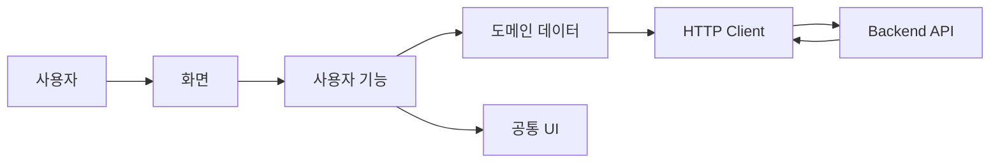

# PULSE Frontend

> 콘텐츠를 공유하고, 반응을 나누고, 다시 찾아보는<br />
> 이미지 중심 커뮤니티의 사용자 경험을 구현합니다.

[](https://github.com/BS-Stack-Lab/KTB4-ian-community-FE/actions/workflows/ci.yml)

[Backend Repository](https://github.com/BS-Stack-Lab/KTB4-ian-community-BE)
· [Frontend 서비스 영상](#frontend-서비스-영상)

## 프로젝트 소개

PULSE는 기획, UI 디자인, Frontend, Backend, 인프라와 배포까지 혼자
설계하고 구현한 개인 프로젝트입니다.

이미지와 이야기를 공유하고, 댓글과 좋아요로 소통하며, 관심 있는 게시글을
북마크할 수 있는 커뮤니티 서비스를 목표로 개발했습니다.

이 저장소에서는 사용자가 직접 경험하는 화면과 상호작용을 중심으로 SPA
내비게이션, 인증 상태, API 통신, 이미지 편집, 반응형 UI와 테스트를
담당합니다.

## 프로젝트 정보

| 항목 | 내용 |
| --- | --- |
| 개발 형태 | 개인 프로젝트 |
| 개발 인원 | 1명 |
| 전체 담당 | 기획, UI 디자인, Frontend, Backend, 인프라, 배포 |
| Frontend 담당 | UI 구현, 상태 관리, API 연동, 테스트, Frontend 배포 |
| 지원 환경 | Desktop, Tablet, Mobile |

## Frontend 서비스 영상

> 실제 사용자의 관점에서 주요 화면과 상호작용을 보여주는 영상입니다.

<!--
GitHub에 MP4 영상을 업로드한 뒤 생성된 attachment URL을 아래에 한 줄로
붙여 넣으세요. 예: https://github.com/user-attachments/assets/...
-->

서비스 영상은 준비 중입니다.

### 시연 내용

1. 회원가입과 로그인
2. 피드 조회와 게시글 상세 이동
3. 이미지 선택과 크롭
4. 게시글 작성·수정·삭제
5. 댓글 작성·수정·삭제
6. 좋아요와 북마크
7. 프로필 이미지와 비밀번호 변경
8. 모바일·데스크톱 반응형 화면
9. 세션 만료와 자동 갱신
10. 로딩·오류 상태 처리

## 주요 기능

### 콘텐츠 공유

이미지와 함께 게시글을 작성하고, 작성한 콘텐츠를 수정하거나 삭제할 수
있습니다. 업로드 전에 이미지의 크롭 영역과 표시 위치를 조정할 수 있습니다.

### 반응과 소통

게시글에 좋아요를 남기거나 댓글을 작성할 수 있습니다. 자신의 댓글은
수정하거나 삭제할 수 있고, 모든 변경 상태는 화면에 즉시 반영됩니다.

### 나중에 다시 보기

관심 있는 게시글을 북마크하고, 별도의 모아보기 화면에서 다시 확인할 수
있습니다.

### 프로필과 계정 관리

닉네임, 프로필 이미지와 비밀번호를 변경하고 로그아웃이나 회원 탈퇴 등
계정 상태를 직접 관리할 수 있습니다.

## Frontend 핵심 구현

### 화면과 기능의 책임 분리

화면, 사용자 기능, 도메인 데이터와 공통 UI의 책임을 분리했습니다.

게시글이나 사용자 데이터처럼 여러 화면에서 사용하는 로직은 도메인 단위로
관리하고, 작성·수정·삭제와 같은 사용자 행동은 독립적인 기능으로 구성해
변경 범위를 줄였습니다.

### 재사용 가능한 UI 시스템

버튼, 모달, 옵션 메뉴, 페이지 헤더, 아바타와 Skeleton을 공통 UI로
구성했습니다.

색상과 타이포그래피는 Design Token으로 관리해 화면마다 스타일 값이
달라지는 문제를 줄이고 일관된 시각 체계를 유지합니다.

### SPA 내비게이션

페이지 전체를 다시 불러오지 않고 화면을 전환하는 SPA 구조를 적용했습니다.

로그인 여부에 따라 접근할 수 있는 화면을 구분하며, 새로고침이나 브라우저
뒤로 가기 이후에도 현재 화면을 복원합니다.

### 인증 상태 관리

인증 Token은 브라우저 JavaScript에서 직접 저장하지 않고 Cookie를 통해
전달합니다. Frontend는 로그인한 사용자 정보와 Token 만료 시점을 관리하고,
만료 전에 세션 갱신을 요청합니다.

여러 탭이 동시에 열려 있을 때는 탭 간 통신과 브라우저 Lock을 활용합니다.

- 여러 탭에서 동일한 갱신 요청을 중복 실행하지 않음
- 한 탭에서 갱신된 세션 상태를 다른 탭에도 전달
- 로그아웃과 세션 만료 상태를 모든 탭에 반영
- 일시적인 네트워크 장애 발생 시 제한적으로 재시도

### CSRF 보호

데이터를 변경하는 요청은 CSRF Token을 확인한 뒤 전송합니다.

동시에 여러 요청이 발생해 Cookie의 Token과 요청 Header의 Token이
달라지는 경쟁 상태를 방지하도록 요청 흐름을 제어했습니다.

### 미디어 작업 오케스트레이션

이미지 선택부터 게시글이나 프로필에 반영되기까지의 상태를 하나의 작업으로
관리합니다.

1. 이미지 선택과 미리보기
2. 크롭 영역과 표시 위치 설정
3. 업로드 정보 발급
4. 원본 이미지 업로드
5. 서버 처리 완료 확인
6. 게시글 또는 프로필 반영
7. 취소·실패 시 임시 작업 정리

기존 이미지와 새 이미지를 공통 모델로 정규화해 작성 화면과 수정 화면이
동일한 편집 로직을 사용할 수 있도록 구성했습니다.

### 안전한 애플리케이션 업데이트

새로운 Frontend 버전이 배포되면 버전 정보를 감지합니다.

게시글이나 댓글을 저장하는 중에는 새로고침을 미뤄 사용자 입력이 사라지지
않도록 하고, 작업이 완료된 안전한 시점에 업데이트합니다.

### 오류와 상태 표현

서버 오류 코드를 사용자가 이해할 수 있는 메시지로 변환합니다.

인증 만료, 입력값 오류, 네트워크 장애, 권한 부족과 서버 오류를 구분하고
각 상황에 맞는 화면과 복구 방법을 제공합니다.

## Frontend 구성



| 영역 | 책임 |
| --- | --- |
| 화면 | 내비게이션과 페이지 구성 |
| 사용자 기능 | 인증, 작성, 수정, 삭제와 이미지 편집 |
| 도메인 | 사용자, 게시글, 댓글과 미디어 데이터 |
| 공통 UI | 버튼, 모달, 메뉴, Skeleton과 Design Token |
| 통신 | 인증, CSRF, 오류 변환과 요청 재시도 |
| 업데이트 | 배포 버전 감지와 안전한 새로고침 |

## 기술 스택

| 분류 | 기술 | 사용 목적 |
| --- | --- | --- |
| UI | React 19 | 컴포넌트와 사용자 상태 관리 |
| Build | Webpack, Babel | 번들 생성과 브라우저 호환 |
| Image | react-easy-crop | 이미지 크롭과 위치 조정 |
| Styling | CSS, Design Tokens | 반응형 UI와 스타일 일관성 |
| Unit Test | Vitest, Testing Library | 컴포넌트와 도메인 로직 검증 |
| E2E Test | Playwright | 실제 사용자 흐름 검증 |
| Quality | Prettier | 일관된 코드 포맷 |
| Runtime | Nginx, Docker | 정적 자산 배포 |
| Automation | GitHub Actions | 빌드와 테스트 자동화 |

## 주요 트러블슈팅

| 문제 | 해결 | 결과 |
| --- | --- | --- |
| 여러 탭에서 세션 갱신 요청이 중복됨 | 탭 간 통신과 브라우저 Lock을 이용해 갱신 작업 공유 | 중복 요청과 세션 충돌 감소 |
| 동시에 요청할 때 CSRF Token이 불일치함 | Token 확인과 요청 전송 사이의 비동기 경계를 최소화 | 간헐적인 요청 실패 방지 |
| 이미지 업로드 실패 후 임시 상태가 남음 | 미디어 작업을 단계별로 관리하고 취소 시 정리 | 재시도 가능한 편집 경험 제공 |
| 배포 직후 새로고침으로 작성 데이터가 사라질 수 있음 | 데이터 변경 작업 중 업데이트를 지연 | 사용자 입력 유실 방지 |
| API 버전에 따라 미디어 응답 형식이 다름 | 화면에 전달하기 전 공통 모델로 정규화 | UI 로직의 API 의존도 감소 |

## 테스트 전략

### Unit Test

- 입력값 검증
- 날짜와 숫자 포맷
- 게시글 정렬
- 미디어 상태 변환
- 세션 갱신
- 공통 UI 동작

### Integration Test

- 회원가입과 로그인
- 게시글 작성·수정·삭제
- 댓글 작성·수정·삭제
- 프로필과 비밀번호 변경
- 세션 만료와 자동 갱신
- 기존 API와 신규 미디어 API 호환

### UI·E2E Test

- 실제 사용자 행동 기반 화면 검증
- 다양한 화면 크기에서의 레이아웃 검증
- 키보드 포커스와 모달 상호작용
- 실제 Backend와 연결된 주요 사용자 시나리오
- 여러 탭 사이의 세션 동기화

## 시작하기

### 요구 사항

- Node.js 24 권장
- npm
- 실행 중인 PULSE Backend

### 설치

```bash
npm ci
```

### 개발 서버 실행

```bash
npm run serve:test
```

Frontend는 `4173`, 로컬 Backend는 `8080` 포트를 기본으로 사용합니다.

## 주요 명령어

| 명령어 | 설명 |
| --- | --- |
| `npm run serve:test` | 개발 서버 실행 |
| `npm run build:react` | 프로덕션 빌드 |
| `npm run format:check` | 코드 포맷 검사 |
| `npm run test:unit` | 단위 테스트 |
| `npm run test:integration` | 통합 테스트 |
| `npm run test:ui` | UI 시나리오 테스트 |
| `npm run test:e2e:backend` | 실제 Backend 연동 테스트 |
| `npm run test:all` | 기본 품질 검사 전체 실행 |

## 배포

Frontend는 정적 자산으로 빌드한 뒤 Nginx 컨테이너에서 실행합니다.

- 파일 내용 기반 버전 이름 적용
- 변경되지 않는 자산의 장기 캐시
- 애플리케이션 문서의 캐시 방지
- 배포 버전 정보 제공
- Non-root 사용자 실행
- 컨테이너 상태 확인
- Commit 기반 이미지 추적

## 관련 저장소

- [PULSE Backend](https://github.com/BS-Stack-Lab/KTB4-ian-community-BE)

## Developer

기획부터 디자인, Frontend, Backend와 배포까지 전 과정을 혼자 진행했습니다.

| 영역 | 담당 내용 |
| --- | --- |
| Product | 서비스 기획과 사용자 흐름 설계 |
| Design | 화면 설계, Design Token과 반응형 UI |
| Frontend | React SPA, 인증 상태, 미디어 편집과 API 연동 |
| Backend | 인증, 커뮤니티 API와 미디어 파이프라인 |
| Infrastructure | Docker, AWS, CI/CD와 운영 자동화 |
