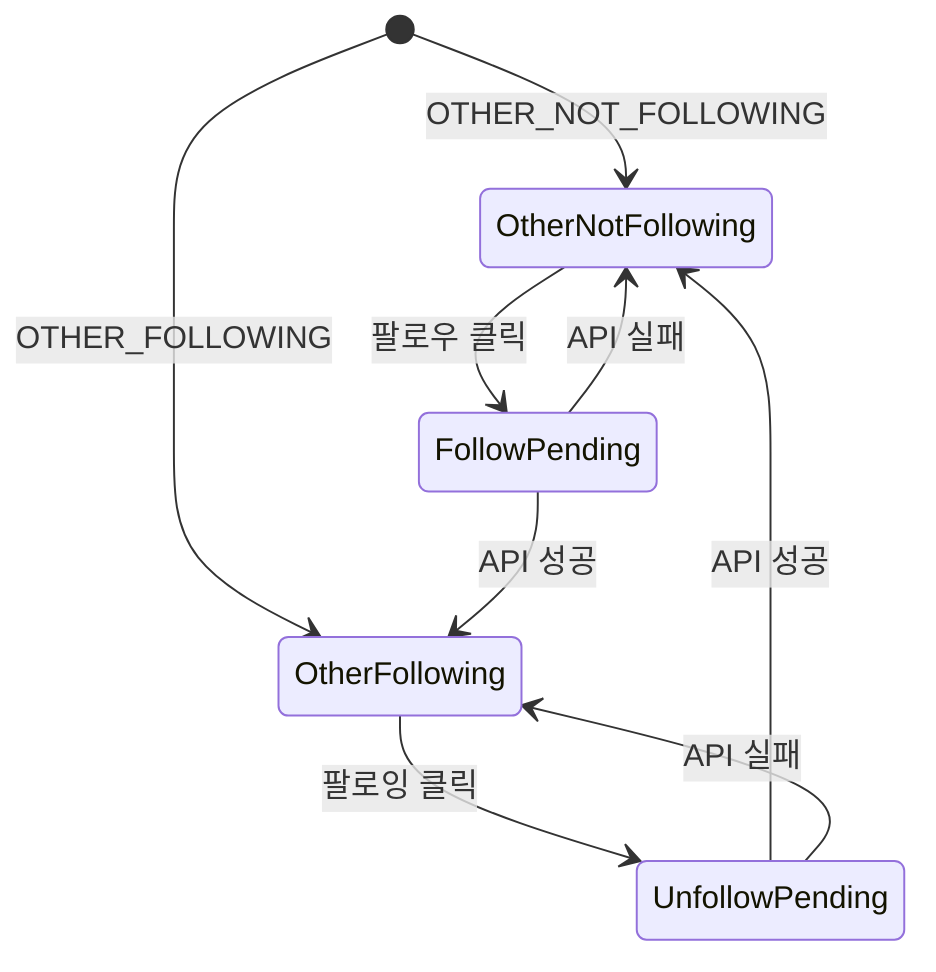
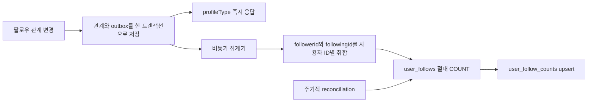

# 마이페이지·팔로우·타이포그래피 설계

## 1. 문서 기준

이 문서는 2026-08-16에 다음 코드를 다시 분석해 작성했다.

- Frontend: `KTB4-ian-community-FE`의 `f3484aac5b0623fd976f3f36c849bcead299d3dc`
- Backend: 연결 저장소 `KTB4-ian-community-BE`의 `origin/main`
  `bc83aeac93cda09e4f72a395cff86edbf778a281`
- 화면 기준: Figma `커뮤니티_GUI_완성` 페이지(`544:1195`)의
  `myPage-ProfileHeader-Self`(`1206:27593`),
  `myPage-ProfileHeader-Other-NotFollowing&Following`(`1294:1349`),
  `ProfileHeader` variant와 `community-post-card`(`1209:29305`)

Frontend가 현재 작업 저장소이며 Backend 코드는 API와 데이터 모델의 실제 규칙을
확인하기 위해 읽기 전용으로 대조했다. 이 문서에서 **현재**는 위 기준 코드에
이미 존재하는 동작, **추가**는 이번 기능 구현으로 변경할 동작을 뜻한다.

> 구현 범위 갱신(2026-08-17): 마이페이지를 제외한 기존 페이지는 Figma
> typography 동기화 외에는 수정하지 않는다. 따라서 `FeedPage`,
> `PostDetailPage`, `BookmarksPage`의 작성자 클릭 진입 연결은 이번 구현에서
> 제외하며, 아래 진입 경로 표에는 후속 연결 계약으로 남긴다. LNB의
> `마이페이지`와 하단 내 프로필 진입, 마이페이지 내부 동작만 이번 변경에
> 포함한다.

핵심 분석 파일은 다음과 같다.

- Frontend: `App.jsx`, `navigation.js`, `CommunityLnb.jsx`, `AuthProvider.jsx`
- Frontend: `userApi.js`, `postApi.js`, `normalizeUser.js`, `normalizePost.js`
- Frontend: `PostCard.jsx`, `FeedPage.jsx`, `PostDetailPage.jsx`,
  `BookmarksPage.jsx`, `httpClient.js`, `app.css`
- Frontend typography: `global.css`, `tokens/typography.css`,
  `WantedSansVariable.woff2`
- Backend: `User`, `Post`, `PostLike`, `Bookmark` entity와 repository/service
- Backend: `UserController`, `UserMediaControllerV2`, `PostControllerV2`
- Backend: `ApiResponse`, `ErrorCode`, `PostV2Response`, `SliceResponse`
- Backend: MySQL/H2 V1~V7 Flyway migration과 Security 설정

## 2. 저장소 분석 결과

| 영역                | 현재 구현                                                                                             | 설계에 미치는 영향                                                                    |
| ------------------- | ----------------------------------------------------------------------------------------------------- | ------------------------------------------------------------------------------------- |
| SPA Route           | `navigation.js`가 직접 `/feed`, `/bookmarks`, `/posts/{postId}`를 해석                                | React Router를 도입하지 않고 같은 라우터에 프로필 Route를 추가한다.                   |
| 인증 사용자         | `AuthProvider`가 `auth.user.userId`를 유지                                                            | 본인 여부와 프로필 이동 경로의 기준으로 사용한다.                                     |
| LNB                 | 마이페이지 메뉴가 없고 하단 사용자 정보는 클릭할 수 없는 `div`                                        | 마이페이지 메뉴와 하단 내 프로필 이동 동작을 추가한다. 프로필 편집 모달은 유지한다.   |
| 작성자 UI           | `PostCard`의 작성자 영역이 카드 상세 열기 영역 안에 있음                                              | 작성자 클릭 이벤트를 분리하고 상세 열기 이벤트 전파를 차단해야 한다.                  |
| 피드 목록           | `FeedPage`가 Slice, 중복 제거, 자동 사전 로딩, 좋아요·북마크 낙관적 갱신을 직접 관리                  | 사용자 피드도 같은 로직을 공유하도록 목록 로직을 hook으로 추출한다.                   |
| 소유자 메뉴         | `ownerOptionsInFooter`가 기존 `OptionMenu`, `EditPostModal`, `DeletePostModal`을 연결                 | Self 마이페이지에서 그대로 재사용한다. 새 드롭다운을 만들지 않는다.                   |
| 폰트 자산·토큰      | `Wanted Sans` variable font와 Figma typography 수치가 이미 저장소에 있음                              | 폰트 교체가 아니라 LNB·PostCard의 오래된 하드코딩을 현재 Figma text style에 매핑한다. |
| 사용자 API          | `/api/users/me`와 본인 전용 프로필 이미지 API만 존재                                                  | 타인 조회가 가능한 V2 프로필 API와 팔로우 API가 필요하다.                             |
| 게시글 API          | `/api/v2/posts`와 `/bookmarks`가 `SliceResponse<PostV2Response>`를 반환                               | 사용자별 피드도 같은 DTO와 Slice 규칙을 사용한다.                                     |
| Backend 사용자 조회 | `/api/users/{userId}`와 프로필 이미지 조회가 본인 외에는 `FORBIDDEN`                                  | 기존 본인 API의 권한을 넓히지 않고 공개 범위를 제한한 프로필 전용 DTO를 추가한다.     |
| 사용자별 게시글     | `PostService#getPostsByUser`와 repository 쿼리는 있으나 `Page`이며 Controller에서 미사용              | `Slice`로 바꾸고 V2 사용자 피드 endpoint에 연결한다.                                  |
| 데이터베이스        | `users`, `posts`, `post_likes`, `bookmarks`, Media V2가 Flyway MySQL/H2로 관리됨                      | 팔로우 관계·카운트 projection·outbox도 두 DB migration을 함께 추가한다.               |
| 인증·CSRF           | HttpOnly 인증 Cookie와 Spring SPA CSRF, Frontend `httpClient`가 unsafe 요청에 CSRF Header를 자동 추가 | 팔로우·언팔로우도 반드시 `httpClient`를 사용한다.                                     |

## 3. 범위

### 포함

- 내 마이페이지와 다른 사용자 마이페이지
- `ProfileHeader-Self`, `ProfileHeader-Other-NotFollowing`,
  `ProfileHeader-Other-Following`
- 프로필 대상 사용자가 작성한 피드 Slice
- Self 피드의 기존 저장·수정·삭제 옵션 메뉴
- Other 피드의 기존 북마크 버튼
- 팔로우·언팔로우와 팔로워·팔로잉 카운트
- LNB `마이페이지`와 하단 내 프로필의 `/mypage` 진입 동선
- `myPage`에서 사용하는 LNB, ProfileHeader, PostCard의 Figma typography 동기화
- 사용자 ID별 비동기 카운트 집계와 주기적 reconciliation
- Unit, Integration, UI, 실제 Backend E2E 테스트

### 제외

- 팔로워·팔로잉 사용자 목록 화면과 목록 API
- 비공개 계정, 팔로우 승인, 차단, 알림
- 프로필 소개문과 배경 이미지
- 기존 프로필 편집·비밀번호 변경 모달의 기능 변경
- 피드·피드 상세·북마크 페이지의 작성자 클릭 동작 변경

Figma에는 숫자 카운트와 관계 변경 버튼만 정의되어 있으므로 목록 화면은 이번
범위에서 제외한다. 후속 요구가 생기면 별도 Route와 Slice API로 확장한다.

## 4. 화면과 Route 계약

### 프로필 상태

| 대상                 | Route             | API `profileType`     | Header               | 팔로우 버튼     | 피드 카드 우측 액션 |
| -------------------- | ----------------- | --------------------- | -------------------- | --------------- | ------------------- |
| 로그인 사용자        | `/mypage`         | `SELF`                | Self                 | 렌더링하지 않음 | 기존 하단 옵션 메뉴 |
| 팔로우하지 않은 타인 | `/users/{userId}` | `OTHER_NOT_FOLLOWING` | Other / NotFollowing | `팔로우`        | 기존 북마크 버튼    |
| 팔로우 중인 타인     | `/users/{userId}` | `OTHER_FOLLOWING`     | Other / Following    | `팔로잉`        | 기존 북마크 버튼    |

`profileType`은 서버가 인증 사용자와 대상 사용자를 비교하고 authoritative
`user_follows` 관계를 조회해 결정한다. 클라이언트는 `mine`과 `following`
boolean을 조합하지 않고 이 값 하나로 Header variant를 선택한다.

### 진입 경로

`이번 구현`은 LNB 두 경로만 연결한다. `후속 계약`은 API와 Route는 준비하지만
기존 페이지 무수정 제약에 따라 해당 페이지의 클릭 handler는 변경하지 않는다.

| 상태      | 출발 UI                   | 작성자        | 목적지              |
| --------- | ------------------------- | ------------- | ------------------- |
| 이번 구현 | LNB `마이페이지`          | 본인          | `/mypage`           |
| 이번 구현 | LNB 하단 아바타·닉네임    | 본인          | `/mypage`           |
| 후속 계약 | 피드 카드 아바타·닉네임   | 본인          | `/mypage`           |
| 후속 계약 | 피드 카드 아바타·닉네임   | 다른 사용자 A | `/users/{A.userId}` |
| 후속 계약 | 피드 상세 아바타·닉네임   | 본인          | `/mypage`           |
| 후속 계약 | 피드 상세 아바타·닉네임   | 다른 사용자 A | `/users/{A.userId}` |
| 후속 계약 | 북마크 카드 아바타·닉네임 | 본인          | `/mypage`           |
| 후속 계약 | 북마크 카드 아바타·닉네임 | 다른 사용자 A | `/users/{A.userId}` |

- `/users/{내 userId}`로 직접 진입하면 `/mypage`로 replace한다.
- `userId`는 양의 정수 문자열만 Route로 인정한다. 나머지는 Not Found로 보낸다.
- ID 비교는 API의 number와 Route의 string 차이로 오판하지 않도록
  `String(left) === String(right)`를 사용하는 공용 helper에서 수행한다.
- 작성자 버튼 클릭은 `stopPropagation()`으로 카드 상세 이동을 발생시키지
  않는다.

### Figma 대응

| 대상                                         | Node ID      | 적용 기준                        |
| -------------------------------------------- | ------------ | -------------------------------- |
| `myPage-ProfileHeader-Self`                  | `1206:27593` | 480px 콘텐츠, 30px 외곽 radius   |
| `myPage-ProfileHeader-Other-NotFollowing...` | `1294:1349`  | Other 전체 화면 기준             |
| `ProfileHeader-Self`                         | `1206:27771` | 액션 버튼 없음                   |
| `ProfileHeader-Other-NotFollowing`           | `1206:27788` | 104 × 40px Primary `팔로우` 버튼 |
| `ProfileHeader-Other-Following`              | `1206:27810` | 104 × 40px Outline `팔로잉` 버튼 |
| Self 화면 첫 `community-post-card`           | `1209:29086` | Self 카드 typography와 더보기    |
| 공용 `community-post-card`                   | `1209:29305` | 피드 카드 typography 기준        |
| `myPage` LNB                                 | `1294:1492`  | LNB typography 기준              |

현재 `.page`와 피드·상세·북마크가 이미 480px, 30px radius, 760px 이하 반응형
규칙을 사용하므로 마이페이지도 같은 shell을 확장한다. `UserAvatar`는 CSS가
34px로 고정되어 있으므로 `size` prop이 실제 스타일에도 반영되도록 CSS custom
property 또는 size modifier를 추가하되 기본 34px snapshot은 유지한다.

## 5. Figma 타이포그래피 동기화

### 기준과 현재 상태

Figma node의 Design Context와 variable definition을 직접 조회한 값을 기준으로
한다. 생성된 Tailwind 표현은 복사하지 않고 저장소의 plain CSS와 기존 token으로
변환한다.

- Figma font family: `Wanted Sans`
- 저장소 font family: `Wanted Sans`
- font asset: `src/shared/assets/fonts/WantedSansVariable.woff2`
- `@font-face`: `src/shared/styles/global.css`에 weight `400 900`으로 이미 등록됨
- typography token: `src/shared/styles/tokens/typography.css`에 Figma의 size,
  weight, line-height, letter-spacing이 이미 정의됨

따라서 새 폰트 파일이나 외부 CDN을 추가하지 않는다. 이번 동기화의 핵심은
`app.css`에 남은 이전 하드코딩을 Figma가 현재 사용 중인 semantic text style로
교체하는 것이다. 숫자를 다시 하드코딩하지 않고 기존 CSS custom property를
사용해 다음 Figma 변경에도 token 한 곳에서 수렴시킨다.

### 서비스와 Figma 차이

| UI 역할                  | Figma node / style                                 | 현재 서비스                 | 목표                        |
| ------------------------ | -------------------------------------------------- | --------------------------- | --------------------------- |
| 전역 font family         | 모든 기준 node / `Wanted Sans`                     | `Wanted Sans` variable font | 변경 없음                   |
| LNB 메뉴                 | `1294:1500` 등 / Body2 Normal Medium               | 13px / 500 / 18px / 0.252px | 15px / 500 / 22px / 0.1px   |
| LNB `회원정보`           | `1294:1508` / Label2 Normal Medium                 | 11px / 500 / 14px / 0.311px | 12px / 500 / 16px / 0.252px |
| LNB 하단 닉네임          | `1294:1523` / Body2 Normal Semibold                | 13px / 600 / 18px / 0.252px | 15px / 600 / 22px / 0.1px   |
| LNB `로그아웃`           | `1294:1524` / Caption Medium                       | 11px / 500 / 14px / 0.311px | 변경 없음                   |
| ProfileHeader 닉네임     | `1206:27780` 등 / Title3 Semibold                  | 신규 UI                     | 20px / 600 / 28px / -0.12px |
| ProfileHeader 통계 label | `1206:27783` 등 / Label1 Normal Regular            | 신규 UI                     | 13px / 400 / 18px / 0.252px |
| ProfileHeader 통계 count | `1206:27784` 등 / Label1 Normal Medium             | 신규 UI                     | 13px / 500 / 18px / 0.252px |
| 팔로우·팔로잉 버튼       | `1206:27802`, `1206:27824` / Body2 Normal Semibold | 신규 UI                     | 15px / 600 / 22px / 0.1px   |
| PostCard 작성자          | `1209:29312` / Body1 Normal Semibold               | 13px / 600 / 18px / 0.252px | 16px / 600 / 24px / 0.057px |
| PostCard 조회·시간       | `1209:29314` / Body2 Normal Regular                | 12px / 400 / 16px / 0.302px | 15px / 400 / 22px / 0.1px   |
| PostCard 본문            | `1209:29326` / Body2 Reading Regular               | 12px / 400 / 18px / 0.252px | 15px / 400 / 24px / 0.1px   |
| PostCard 좋아요·댓글 수  | `1209:29334` 등 / Label1 Normal Regular            | 13px / 400 / 18px / 0.252px | 변경 없음                   |

표의 순서는 `font-size / font-weight / line-height / letter-spacing`이다. Figma의
variable key에는 `font-famliy`, `Nomal`, `Regualr`, `Teritray` 같은 오탈자가
있지만 구현의 새 public 식별자에는 전파하지 않는다. 저장소에 이미 있는 정상화된
token 이름을 사용한다.

### CSS 적용 계약

| selector 또는 컴포넌트           | 적용 token            |
| -------------------------------- | --------------------- |
| `.lnb-navigation__item`          | Body2 Normal Medium   |
| `.lnb-account__label`            | Label2 Normal Medium  |
| `.lnb-user__identity strong`     | Body2 Normal Semibold |
| `.lnb-user__logout`              | Caption Medium        |
| `.profile-header__nickname`      | Title3 Semibold       |
| `.profile-header__stat-label`    | Label1 Normal Regular |
| `.profile-header__stat-count`    | Label1 Normal Medium  |
| `.profile-header__follow-button` | Body2 Normal Semibold |
| `.post-card__header strong`      | Body1 Normal Semibold |
| `.post-card__metadata`           | Body2 Normal Regular  |
| `.post-card__content`            | Body2 Reading Regular |
| `.post-actions`의 count          | Label1 Normal Regular |

LNB 메뉴의 line-height 증가에 따라 고정 높이 `28px`는 Figma의 padding
`4px 6px`와 합쳐 `30px`로 조정한다. PostCard는 공용 컴포넌트이므로 이 변경은
마이페이지뿐 아니라 Feed, Detail, Bookmarks에도 동일하게 반영한다. 이는 화면별
예외가 아니라 `커뮤니티_GUI_완성`의 공용 카드 style을 따르는 의도된 변경이다.
본문의 줄바꿈과 카드 전체 높이가 달라질 수 있으므로 480px와 모바일 viewport의
visual regression을 반드시 함께 갱신한다.

스크린샷 검증은 `document.fonts.ready` 이후에 수행한다. fallback font로 촬영된
이미지를 승인 기준으로 사용하지 않으며, 브라우저 computed style에서
`font-family`, `font-size`, `font-weight`, `line-height`, `letter-spacing`도 함께
검증한다.

## 6. Frontend 설계

### 파일 책임

```text
src
├─ app
│  ├─ App.jsx                         profile Route 렌더링과 LNB 연결
│  ├─ router/navigation.js            /mypage, /users/:userId 해석
│  ├─ layouts/CommunityLnb.jsx         마이페이지와 하단 내 프로필 이동
│  └─ app.css                          Figma text style selector 매핑과 Profile UI
├─ entities
│  ├─ post
│  │  ├─ api/postApi.js                사용자별 피드 요청
│  │  └─ ui/PostCard.jsx               작성자 버튼과 기존 카드 액션
│  └─ user
│     ├─ api/userApi.js                프로필, 팔로우, 언팔로우
│     ├─ model/normalizeUserProfile.js Profile DTO 정규화
│     └─ ui/ProfileHeader.jsx          세 Header variant
├─ features/post/list
│  └─ model/usePostSlice.js            Slice·좋아요·북마크 공용 상태
├─ pages/profile/ProfilePage.jsx       Header, 피드, 수정·삭제 modal 조합
└─ shared/styles
   ├─ global.css                       기존 Wanted Sans @font-face 유지
   └─ tokens/typography.css            Figma typography token 단일 기준
```

프로젝트가 현재 페이지와 도메인별 `useState`/`useEffect`를 사용하므로 전역 상태
라이브러리는 추가하지 않는다.

### 공용 프로필 경로 helper

`profilePathFor(authorUserId, viewerUserId)`를 한 곳에 두고 Feed, Detail,
Bookmarks, LNB에서 사용한다.

```js
profilePathFor(authorUserId, viewerUserId);
// 같은 사용자: /mypage
// 다른 사용자: /users/{authorUserId}
```

값이 없거나 양의 정수가 아니면 버튼을 비활성화하고 프로필 Route를 만들지
않는다. 화면마다 본인 판별식을 다시 구현하지 않는다.

### 프로필 로딩

1. Route에서 `profileUserId`를 결정한다. `/mypage`는 `auth.user.userId`를 쓴다.
2. 프로필 요약과 첫 사용자 피드 Slice를 각각 `AbortController`와 함께 병렬
   요청한다.
3. Header와 피드의 loading/error/empty 상태를 분리한다. Header 실패가 이전
   사용자의 데이터를 남기지 않도록 Route 변경 즉시 상태를 초기화한다.
4. 피드는 현재 Feed와 같은 `page=0`, `size=10`, `hasNext`, ID 중복 제거,
   남은 카드 5개 시 사전 로딩, 수동 `피드 더 보기` fallback을 사용한다.
5. Route 또는 컴포넌트 unmount 시 진행 중인 요청을 abort한다.

### 피드 카드 정책

- Self: `author.userId === auth.user.userId`를 다시 확인한 뒤
  `ownerOptionsInFooter`, bookmark, edit, delete callback을 전달한다.
- Other: edit/delete callback을 전달하지 않고 기존 하단 북마크 callback만
  전달한다.
- 수정 성공은 첫 Slice를 다시 조회한다.
- 삭제 성공은 현재 목록에서 해당 `postId`를 제거한다.
- 좋아요와 북마크는 기존 낙관적 갱신과 실패 rollback을 유지한다.
- `OptionMenu`, `EditPostModal`, `DeletePostModal`을 그대로 사용한다.

### 팔로우 상태 전이



- `SELF`는 위 상태 머신에 들어가지 않으며 버튼과 관계 변경 handler가 없다.
- pending 동안 버튼을 disable해 중복 요청을 막는다.
- 클릭 즉시 `profileType`과 화면의 카운트를 낙관적으로 변경한다.
- 성공 응답의 `profileType`으로 Header를 확정한다.
- 실패하면 요청 직전 `profileType`과 카운트를 복원하고 `ApiError.message`를
  표시한다.
- 카운트는 최종 정합성이므로 성공 후 250ms, 500ms, 1s 간격으로 프로필을 최대
  3회 재검증한다. projection이 아직 따라오지 않으면 낙관적 값을 유지하고 다음
  화면 진입·visibility 복귀 시 다시 조회한다.

### 접근성

- 작성자 아바타·닉네임은 하나의 실제 `button` 또는 `a`로 묶고
  `aria-label="{nickname} 프로필 보기"`를 제공한다.
- 팔로우 버튼은 `aria-pressed`로 관계 상태를 전달하고 pending 동안
  `aria-busy`와 `disabled`를 적용한다.
- Header 뒤로가기, 옵션 메뉴의 Escape·focus 복원은 현재 `PageHeader`와
  `OptionMenu` 패턴을 유지한다.
- Self Header DOM에는 숨긴 팔로우 버튼도 만들지 않는다.

## 7. Backend 설계

### 추가 구성 요소

| 계층       | 추가·변경 대상                | 책임                                        |
| ---------- | ----------------------------- | ------------------------------------------- |
| domain     | `UserFollow`                  | follower와 following의 관계 원본            |
| domain     | `UserFollowCount`             | 비동기 카운트 read projection               |
| domain     | `FollowCountOutbox`           | 관계 변경 후 집계할 사용자 ID의 영속 이벤트 |
| repository | `UserFollowRepository`        | 관계 존재·추가·삭제와 원본 COUNT            |
| repository | `UserFollowCountRepository`   | projection 조회·upsert                      |
| repository | `FollowCountOutboxRepository` | 미처리 이벤트 claim·완료                    |
| service    | `UserProfileService`          | 공개 프로필 DTO와 `profileType` 계산        |
| service    | `FollowService`               | 멱등 팔로우·언팔로우와 outbox 기록          |
| worker     | `FollowCountProjector`        | 사용자 ID 취합, 절대 카운트 재계산          |
| worker     | `FollowCountReconciler`       | 주기적 전체 재집계와 누락 보정              |
| controller | `UserProfileControllerV2`     | 프로필·팔로우 endpoint                      |
| controller | `PostControllerV2`            | 사용자별 피드 endpoint 추가                 |

### 사용자별 피드

현재 미사용인 `PostService#getPostsByUser`와
`PostRepository#findAllByAuthorUser_UserIdAndPostDeletedFalse`의 반환형을
`Page<Post>`에서 `Slice<Post>`로 바꾼다. `PostControllerV2`의 기존 `map()`을
재사용해 `liked`, `bookmarked`, Media V2와 legacy fallback을 현재 로그인
사용자 기준으로 채운다. 정렬은 repository 이름에
`OrderByCreatedAtDescPostIdDesc`를 포함하고 DB index도 같은 순서를 사용한다.

### 프로필 공개 범위

기존 `/api/users/{userId}`와 `/api/v2/users/{userId}/profile-image`는 본인 전용
호환 API로 유지한다. 새 프로필 endpoint는 email, 비밀번호 변경 시각 등 계정
정보를 노출하지 않고 다음 값만 반환한다.

- `userId`, `nickname`
- `profileMedia`, `legacyProfileImageUrl`
- `followerCount`, `followingCount`, `countUpdatedAt`
- `profileType`

## 8. 팔로우 카운트 정합성

관계 여부는 강한 정합성, 숫자 카운트는 최종 정합성을 사용한다.



1. `FollowService`는 `user_follows` 변경과 outbox insert를 같은 transaction에서
   수행한다.
2. 집계기는 미처리 이벤트를 batch로 claim하고 `follower_id`와
   `following_id`를 중복 제거해 영향받은 사용자 ID 집합을 만든다.
3. 각 사용자 ID의 팔로워·팔로잉 수를 `user_follows`에서 다시 COUNT한다.
4. `+1`/`-1` 연산 대신 절대값을 projection에 upsert한다. 이벤트가 중복
   처리되어도 같은 결과에 수렴한다.
5. projection 저장과 outbox 완료 처리를 한 transaction으로 묶는다. 중간 실패는
   retry한다.
6. reconciliation은 주기적으로 활성 사용자 전체의 원본 COUNT와 projection을
   비교해 누락, 장기 지연, worker 장애를 보정한다.
7. API의 `profileType`은 projection이 아니라 `user_follows`를 직접 조회한다.
   따라서 카운트 지연이 팔로우 버튼 상태에 영향을 주지 않는다.

계정 탈퇴는 현재 soft delete를 유지하되 해당 사용자의 팔로우 관계를 정리하고
영향받은 사용자 ID를 outbox에 기록한다. 집계 원본 쿼리도 양쪽 사용자의
`user_deleted=false`를 조건으로 사용한다.

## 9. 정합성·보안 규칙

- Self Header에서는 관계 변경 버튼과 handler를 만들지 않는다.
- UI를 우회한 본인 대상 API 요청은 서비스 검증과 DB CHECK로 거절한다.
- `(follower_id, following_id)` UNIQUE로 중복 관계를 막는다.
- 팔로우 POST와 언팔로우 DELETE는 멱등하게 처리한다.
- 동시에 들어온 팔로우 INSERT의 UNIQUE 충돌은 현재 관계를 재조회해
  `ALREADY_FOLLOWING` 성공으로 변환한다.
- 탈퇴 사용자는 현재 Backend 규칙대로 `USER_ALREADY_DELETED`, 존재하지 않는
  사용자는 `USER_NOT_FOUND`로 처리한다.
- 프로필과 사용자 피드에는 email 등 계정 정보를 포함하지 않는다.
- 모든 조회·변경 endpoint는 인증이 필요하다.
- POST와 DELETE는 기존 CSRF Cookie/Header 검증을 그대로 적용한다.
- 게시글 수정·삭제 권한은 Frontend 표시 여부와 별개로 현재 Backend 소유권
  검사를 최종 기준으로 유지한다.
- 피드의 `liked`, `bookmarked`는 프로필 대상이 아니라 로그인 사용자를 기준으로
  계산한다.

## 10. 테스트 계획

### Frontend Unit

- Figma typography token의 font size, weight, line-height, letter-spacing 계약
- `/mypage`, `/users/{positiveId}` Route 해석과 잘못된 ID 처리
- 본인/타인 프로필 경로 helper와 number/string ID 비교
- `normalizeUserProfile`의 camelCase, snake_case, Media V2 fallback
- ProfileHeader 세 variant와 Self 버튼 부재
- pending, 성공, 실패 시 팔로우 상태 전이
- PostCard 작성자 클릭이 카드 상세 열기를 발생시키지 않음
- Self 옵션 메뉴가 저장·수정·삭제를 기존 순서로 제공
- LNB 마이페이지와 하단 사용자 정보 callback

### Frontend Integration

- `userApi`와 `postApi`가 새 V2 경로, query, CSRF를 사용
- `httpClient`가 `ApiResponse.data`를 벗긴 뒤 profile DTO를 전달
- 사용자 변경 시 이전 요청 abort와 상태 초기화
- Slice 중복 제거, 사전 로딩, 좋아요·북마크 rollback
- 수정 후 reload, 삭제 후 현재 목록 제거

### Frontend UI

- `document.fonts.ready` 이후 Wanted Sans가 실제 로드되었는지 확인
- LNB, ProfileHeader, PostCard의 computed typography가 Figma 차이표와 일치
- Figma 기준 1920 × 1080에서 480px shell, Header, 버튼, 카드 위치 비교
- Self, Other/NotFollowing, Other/Following visual 상태
- 1024, 760, 390px 반응형과 가로 overflow 부재
- 키보드 작성자 이동, 팔로우 버튼, 옵션 메뉴 focus/Escape
- loading, empty, error, pending screenshot

### Backend

- `UserFollowRepository` UNIQUE와 self CHECK migration 검증
- FollowService 최초/중복/동시 팔로우와 멱등 언팔로우
- 프로필 `SELF`, `OTHER_FOLLOWING`, `OTHER_NOT_FOLLOWING` 판정
- 사용자별 피드 Slice, 정렬, 삭제 게시글 제외, viewer 기준 liked/bookmarked
- 관계와 outbox의 transaction rollback 원자성
- worker의 사용자 ID 취합, 중복 이벤트 재처리, retry
- reconciliation이 의도적으로 어긋난 projection을 원본 값으로 복구
- MySQL과 H2 Flyway migration 통합 테스트

### 실제 Backend E2E

1. 사용자 A와 B를 생성한다.
2. A가 게시글을 작성한다.
3. A의 LNB·작성자 정보가 `/mypage`와 Self Header로 이동하는지 확인한다.
4. B로 로그인해 Feed, Detail, Bookmarks 각각에서 A의 작성자 정보를 누른다.
5. `/users/{A.userId}`와 `OTHER_NOT_FOLLOWING`을 확인한다.
6. B가 A를 팔로우해 `OTHER_FOLLOWING`으로 즉시 전환되는지 확인한다.
7. eventual count는 제한 시간 동안 polling해 원본 관계 수로 수렴하는지
   확인한다.
8. 언팔로우 후 `OTHER_NOT_FOLLOWING`과 카운트 수렴을 확인한다.
9. A의 Self 피드에서 수정·삭제 옵션, B가 보는 A 피드에서 북마크만 노출되는지
   확인한다.

## 11. 적용 순서

1. 기존 `Wanted Sans` asset과 typography token을 기준으로 LNB와 PostCard의
   selector를 Figma style에 매핑한다.
2. `document.fonts.ready`, computed style, 480px·모바일 screenshot을 포함한 UI
   테스트로 typography 동기화를 먼저 고정한다.
3. MySQL/H2 `user_follows`, `user_follow_counts`, `follow_count_outbox`, 게시글
   index migration을 추가하고 migration 테스트를 통과시킨다.
4. Backend repository, service, worker, reconciliation과 단위·통합 테스트를
   구현한다.
5. 프로필·사용자 피드·팔로우 API와 계약 테스트를 배포한다.
6. outbox 적체, 처리 실패, projection 지연 metric을 확인한다.
7. Frontend Route, LNB, 작성자 링크, ProfileHeader와 ProfilePage를 구현하고
   ProfileHeader에는 Figma semantic text style을 적용한다.
8. 공용 피드 Slice 로직과 기존 PostCard·modal 재사용을 연결한다.
9. Frontend Unit·Integration·UI 테스트를 모두 통과시킨다.
10. 실제 Backend E2E에서 두 사용자 시나리오와 비동기 카운트 수렴을
    확인한다.
11. Frontend를 배포하고 API 오류율, follow UNIQUE 충돌, outbox oldest age를
    관찰한다.

Backend를 먼저 배포하면 기존 Frontend가 새 endpoint를 호출하지 않으므로
하위 호환된다. Frontend 배포 전 API와 migration이 준비되어 있어야 새 Route의
초기 오류를 피할 수 있다.

## 12. 완료 조건

- LNB, ProfileHeader, PostCard가 Figma의 `Wanted Sans` semantic text style과
  일치하고 Feed, Detail, Bookmarks, MyPage에서 같은 공용 카드 typography를
  사용한다.
- LNB 마이페이지·하단 내 프로필과 모든 내 작성자 정보가 `/mypage`로 이동한다.
- Feed, Detail, Bookmarks의 다른 사용자 A 작성자 정보가
  `/users/{A.userId}`로 이동한다.
- Self에는 관계 변경 버튼이 없고 Other에는 서버 `profileType`과 일치하는
  버튼이 있다.
- 팔로우 성공은 `OTHER_FOLLOWING`, 언팔로우 성공은
  `OTHER_NOT_FOLLOWING`으로 즉시 전환된다.
- Self 피드에서만 기존 하단 옵션 메뉴로 저장·수정·삭제할 수 있다.
- Other 피드에는 기존 북마크 버튼이 표시된다.
- 사용자 피드의 pagination, 좋아요, 북마크, 수정, 삭제가 현재 피드와 같은
  방식으로 동작한다.
- 카운트 projection은 이벤트 중복·지연·재시도 후에도 `user_follows`의 실제
  활성 관계 수로 수렴한다.
- Format, build, Unit, Integration, UI, 실제 Backend E2E 검증이 모두 통과한다.
