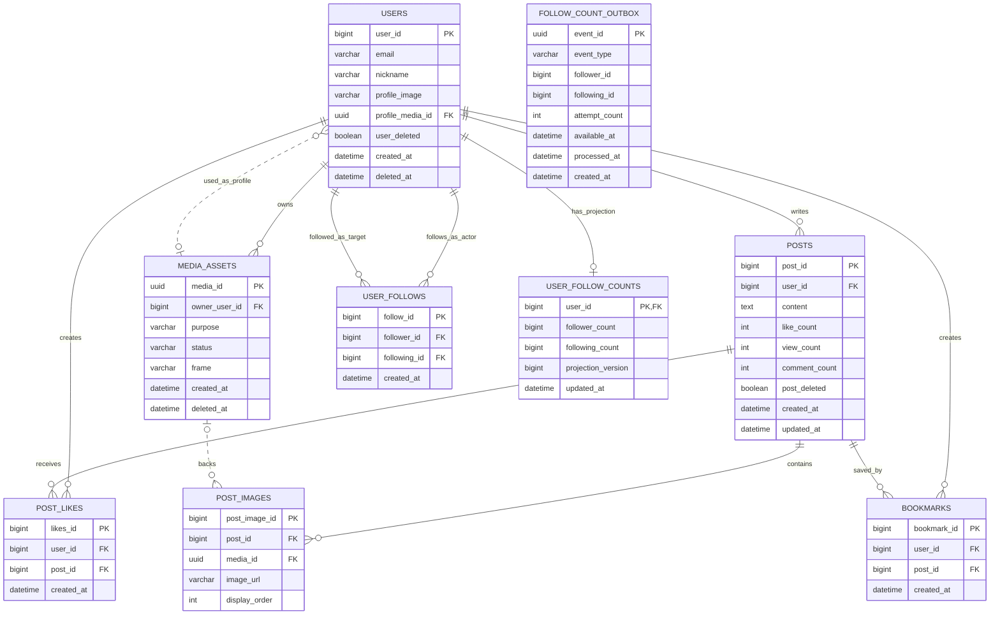

# 마이페이지·팔로우 ERD

## 1. 기준

현재 Backend의 JPA entity와 Flyway schema에서 다음 사실을 확인했다.

- `users.user_id`, `posts.post_id`와 대부분의 관계 PK는 `BIGINT IDENTITY`다.
- 사용자와 게시글은 `user_deleted`, `post_deleted`로 soft delete한다.
- `posts`는 `like_count`, `comment_count`, `view_count`를 저장한다.
- `post_likes`와 `bookmarks`는 `(user_id, post_id)` UNIQUE 관계 테이블이다.
- Media V2는 UUID를 MySQL `BINARY(16)`, H2 `UUID`로 저장한다.
- MySQL과 H2 migration을 함께 유지하며 현재 최신 schema version은 V7이다.

아래 ERD는 마이페이지 조회에 필요한 현재 테이블과 이번 기능의 추가 테이블만
표시한다. 인증 Token, 댓글, Media revision/variant는 이번 관계 설계의 핵심이
아니므로 생략한다.

## 2. 논리·물리 ERD

`USER_FOLLOWS`, `USER_FOLLOW_COUNTS`, `FOLLOW_COUNT_OUTBOX`가 추가 대상이다.
나머지는 현재 테이블이다.



`FOLLOW_COUNT_OUTBOX.follower_id`와 `following_id`는 집계 대상 식별자지만 FK를
두지 않는다. 관계 삭제나 사용자 soft delete 뒤에도 미처리 이벤트가 남아
projection을 복구할 수 있어야 하기 때문이다.

## 3. 테이블 책임

### user_follows

팔로우 관계의 authoritative source다.

- `follower_id`: 팔로우를 건 인증 사용자
- `following_id`: 팔로우 대상 사용자
- 한 사용자 쌍은 최대 한 행만 가진다.
- 본인 관계는 허용하지 않는다.
- 관계 존재 여부와 `profileType`은 이 테이블을 직접 조회한다.

### user_follow_counts

프로필 읽기를 위한 비동기 projection이다.

- 사용자별 최대 한 행
- `follower_count`: 해당 사용자를 팔로우하는 활성 관계 수
- `following_count`: 해당 사용자가 팔로우하는 활성 관계 수
- `projection_version`: 성공적으로 절대 카운트를 쓴 횟수
- `updated_at`: 마지막 성공 집계 시각
- 이 테이블 값은 관계 권한이나 버튼 상태 판정에 사용하지 않는다.

### follow_count_outbox

관계 transaction과 비동기 집계 사이의 전달 보장을 담당한다.

- 관계 insert/delete와 같은 transaction에서 event를 insert한다.
- `event_type`: `FOLLOW_CREATED`, `FOLLOW_DELETED`
- worker는 `processed_at IS NULL`, `available_at <= now()` 행을 claim한다.
- 실패하면 `attempt_count`를 증가시키고 `available_at`을 backoff만큼 미룬다.
- event 하나가 follower와 following 두 사용자 ID를 모두 집계 대상으로 만든다.
- processed event는 운영 보존 기간 후 batch로 삭제할 수 있다.

## 4. MySQL V8 migration 초안

대상 파일:
`src/main/resources/db/migration/mysql/V8__create_user_follows.sql`

```sql
CREATE TABLE user_follows (
    follow_id BIGINT NOT NULL AUTO_INCREMENT,
    follower_id BIGINT NOT NULL,
    following_id BIGINT NOT NULL,
    created_at DATETIME(6) NOT NULL,
    PRIMARY KEY (follow_id),
    CONSTRAINT uk_user_follows_follower_following
        UNIQUE (follower_id, following_id),
    CONSTRAINT chk_user_follows_not_self
        CHECK (follower_id <> following_id),
    CONSTRAINT fk_user_follows_follower
        FOREIGN KEY (follower_id) REFERENCES users (user_id),
    CONSTRAINT fk_user_follows_following
        FOREIGN KEY (following_id) REFERENCES users (user_id),
    INDEX idx_user_follows_following_created
        (following_id, created_at DESC, follow_id DESC),
    INDEX idx_user_follows_follower_created
        (follower_id, created_at DESC, follow_id DESC)
) ENGINE=InnoDB
  DEFAULT CHARSET=utf8mb4
  COLLATE=utf8mb4_0900_ai_ci;

CREATE TABLE user_follow_counts (
    user_id BIGINT NOT NULL,
    follower_count BIGINT NOT NULL DEFAULT 0,
    following_count BIGINT NOT NULL DEFAULT 0,
    projection_version BIGINT NOT NULL DEFAULT 0,
    updated_at DATETIME(6),
    PRIMARY KEY (user_id),
    CONSTRAINT fk_user_follow_counts_user
        FOREIGN KEY (user_id) REFERENCES users (user_id),
    CONSTRAINT chk_user_follow_counts_non_negative
        CHECK (follower_count >= 0 AND following_count >= 0)
) ENGINE=InnoDB
  DEFAULT CHARSET=utf8mb4
  COLLATE=utf8mb4_0900_ai_ci;

CREATE TABLE follow_count_outbox (
    event_id BINARY(16) NOT NULL,
    event_type VARCHAR(32) NOT NULL,
    follower_id BIGINT NOT NULL,
    following_id BIGINT NOT NULL,
    attempt_count INT NOT NULL DEFAULT 0,
    available_at DATETIME(6) NOT NULL,
    processed_at DATETIME(6),
    last_error VARCHAR(500),
    created_at DATETIME(6) NOT NULL,
    PRIMARY KEY (event_id),
    INDEX idx_follow_count_outbox_poll
        (processed_at, available_at, created_at)
) ENGINE=InnoDB
  DEFAULT CHARSET=utf8mb4
  COLLATE=utf8mb4_0900_ai_ci;

CREATE INDEX idx_posts_user_deleted_created
    ON posts (
        user_id,
        post_deleted,
        created_at DESC,
        post_id DESC
    );

INSERT INTO user_follow_counts (
    user_id,
    follower_count,
    following_count,
    projection_version,
    updated_at
)
SELECT
    user_id,
    0,
    0,
    0,
    CURRENT_TIMESTAMP(6)
FROM users
WHERE user_deleted = FALSE;
```

이 feature가 처음 도입될 때 `user_follows`는 비어 있으므로 활성 사용자
projection을 0으로 backfill한다. 기존 관계 데이터를 가져오는 별도 migration이
추가된다면 backfill SELECT를 실제 관계 집계로 교체한다.

## 5. H2 V8 migration 원칙

대상 파일:
`src/main/resources/db/migration/h2/V8__create_user_follows.sql`

MySQL migration과 동일한 테이블·제약·index를 만들되 저장소의 현재 H2 규칙을
따른다.

- `follow_id BIGINT GENERATED BY DEFAULT AS IDENTITY`
- `event_id UUID`
- `DATETIME(6)` 대신 `TIMESTAMP(6)`
- MySQL의 inline `INDEX`는 별도 `CREATE INDEX`로 작성
- `ON DUPLICATE KEY UPDATE`는 repository test에서 H2용 merge/upsert로 분리

MySQL/H2 schema가 달라지지 않도록 기존 `MigrationIntegrationTest`에 테이블,
UNIQUE, CHECK, FK, index 검증을 추가한다.

## 6. 주요 조회

### 관계 여부

```sql
SELECT EXISTS (
    SELECT 1
    FROM user_follows uf
    JOIN users follower
      ON follower.user_id = uf.follower_id
     AND follower.user_deleted = FALSE
    JOIN users following_user
      ON following_user.user_id = uf.following_id
     AND following_user.user_deleted = FALSE
    WHERE uf.follower_id = :viewerUserId
      AND uf.following_id = :profileUserId
);
```

### 프로필 카운트 읽기

```sql
SELECT
    COALESCE(ufc.follower_count, 0) AS follower_count,
    COALESCE(ufc.following_count, 0) AS following_count,
    ufc.updated_at
FROM users u
LEFT JOIN user_follow_counts ufc
  ON ufc.user_id = u.user_id
WHERE u.user_id = :profileUserId
  AND u.user_deleted = FALSE;
```

### 특정 사용자 절대 카운트 재계산

```sql
SELECT COUNT(*) AS follower_count
FROM user_follows uf
JOIN users follower
  ON follower.user_id = uf.follower_id
 AND follower.user_deleted = FALSE
JOIN users following_user
  ON following_user.user_id = uf.following_id
 AND following_user.user_deleted = FALSE
WHERE uf.following_id = :userId;

SELECT COUNT(*) AS following_count
FROM user_follows uf
JOIN users follower
  ON follower.user_id = uf.follower_id
 AND follower.user_deleted = FALSE
JOIN users following_user
  ON following_user.user_id = uf.following_id
 AND following_user.user_deleted = FALSE
WHERE uf.follower_id = :userId;
```

### 사용자별 피드 Slice

```sql
SELECT p.*
FROM posts p
WHERE p.user_id = :profileUserId
  AND p.post_deleted = FALSE
ORDER BY p.created_at DESC, p.post_id DESC
LIMIT :sliceSizePlusOne OFFSET :offset;
```

## 7. 비동기 집계 transaction

### 관계 변경 transaction

```text
팔로우:   user_follows INSERT + follow_count_outbox INSERT → COMMIT
언팔로우: user_follows DELETE + follow_count_outbox INSERT → COMMIT
```

이미 존재하는 팔로우나 이미 없는 언팔로우에는 관계 변화가 없으므로 outbox를
만들지 않는다.

### worker transaction

1. `FOR UPDATE SKIP LOCKED`로 미처리 event batch를 claim한다.
2. batch의 follower/following ID를 하나의 중복 없는 집합으로 취합한다.
3. 각 ID의 두 절대 COUNT를 authoritative relation에서 계산한다.
4. `user_follow_counts`를 upsert하고 `projection_version`을 1 증가시킨다.
5. 같은 transaction에서 event의 `processed_at`을 기록한다.

projection commit 후 event 완료 전에 장애가 발생해도 transaction 전체가
rollback된다. 완료 표시 후 재전달되더라도 절대 COUNT upsert라 중복 증감이
발생하지 않는다.

## 8. Reconciliation

주기적 작업은 활성 사용자 전체를 일정 batch로 나눠 다음을 수행한다.

1. `user_follows`에서 활성 사용자 기준 follower/following count를 다시 집계한다.
2. projection이 없거나 값이 다른 사용자만 upsert한다.
3. 원본 관계가 0인데 projection이 양수인 사용자도 0으로 보정한다.
4. 수정된 행 수, 최대 지연 시간, oldest unprocessed event age를 metric으로
   기록한다.

Reconciliation은 정상 mutation 경로를 대신하지 않는 복구 장치다. API 요청이
카운트 계산 완료를 기다리게 만들지 않는다.

## 9. 동시성과 삭제 정책

- 동시 팔로우는 UNIQUE 충돌이 최종 직렬화 지점이다. 충돌 후 관계가 존재하면
  멱등 성공으로 처리한다.
- 동시 언팔로우는 실제 삭제 행 수가 0이어도 멱등 성공이다.
- 본인 관계는 서비스 검증과 DB CHECK가 함께 차단한다.
- `users`는 현재처럼 soft delete하며 FK의 물리 cascade는 사용하지 않는다.
- 계정 탈퇴 시 해당 사용자가 follower 또는 following인 관계를 삭제하고 삭제된
  각 관계의 상대 사용자 ID가 집계되도록 outbox event를 남긴다.
- 게시글은 현재 soft delete를 유지하며 마이페이지 query에서 제외한다.
- processed outbox 정리와 탈퇴 사용자 follow 정리는 별도 batch에서 수행하되
  projection reconciliation보다 먼저 원본 관계를 바꾸지 않는다.

## 10. JPA 매핑 원칙

- `UserFollow`의 두 사용자 연관은 `@ManyToOne(fetch = LAZY, optional = false)`다.
- `UserFollowCount.userId`는 `@Id`와 `@OneToOne(fetch = LAZY)` 또는 `@MapsId`로
  users와 1:0..1을 표현한다.
- `FollowCountOutbox`의 사용자 ID는 entity 연관이 아닌 `Long` scalar로 둔다.
- 모든 시간 생성은 현재 domain과 같은 `Asia/Seoul` `LocalDateTime` 정책을
  따른다.
- 목록/프로필 조회는 read-only transaction, 관계 변경과 worker는 write
  transaction을 사용한다.
